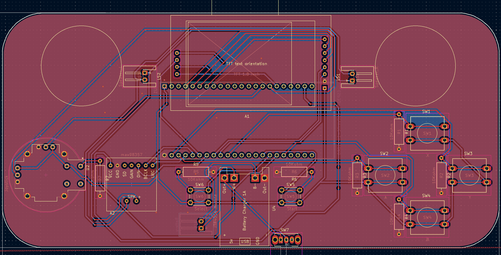
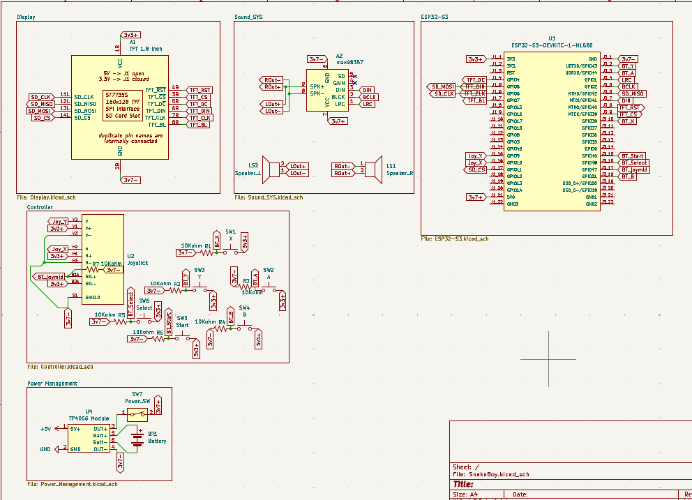
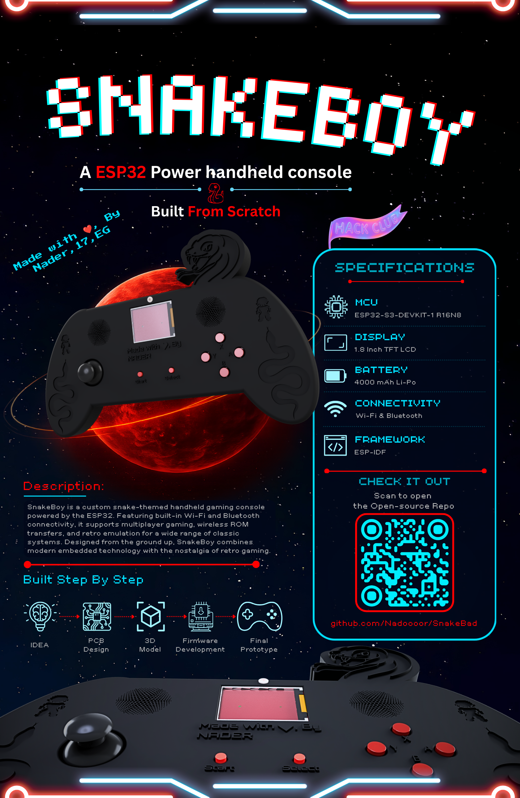

# SnakeBoy
------

  

------

## Description:
SnakeBoy is a custom snake-themed handheld gaming console powered by the ESP32. Featuring built-in Wi-Fi and Bluetooth connectivity, it supports multiplayer gaming, wireless ROM transfers, and retro emulation for a wide range of classic systems.

## Why Iam making This?
I'm making this Device so i can play soo many games on a handheld device that i can take anywhere. And also as a teen from Gen z, i want to try the games my family was playing before my Gen. Like, Super mario, etc.. (dk any other games' names 👀)

## Highlight:
The Device is fully snake-themed and it has a snake had on the top of the device that looks so cool, I just like snakes so much.

## How it works:
1. Charge the battery if it is not charged.
2. Add all the games on the SD card and plug it from the inside.
3. Switch on the device and wait for it to boot.
4. Open your games and have fun yay.

## Some photos of the project:
### PCB:

### 3D PCB:

### Schematic:

### 3D Case & Assembly:

> [!NOTE]
> Here you are the [Onshape Docs](https://cad.onshape.com/documents/0e87dfd5407f7a465ae1d2e0/w/c71d8217d927d32bb865edde/e/80890fb331397a75dcc65cb7)

### The Project's Zine-Page:

## Bill of Materials (BOM)
|Item Name                                                                                    |Purchase Link                                                                                                                                                                  |Quantity    |Price per Unit|Total  |
|---------------------------------------------------------------------------------------------|-------------------------------------------------------------------------------------------------------------------------------------------------------------------------------|------------|--------------|-------|
|TFT LCD Display Module SPI Interface 1.8 Inch 128*160?(the biggest available and cheap)      |https://makerselectronics.com/product/tft-lcd-display-module-spi-interface-1-8-inch-128160/                                                                                    |1           |$5            |$5     |
|12*12mm buttons would be great for the (X Y B A)                                             |https://makerselectronics.com/product/omron-tact-button-switch-12x12x7-3mm/                                                                                                    |4           |$0.07         |$0.28  |
|6*6 mm buttons would be enough for the (Start & Select)                                      |https://makerselectronics.com/product/mini-push-button-switch-2-pin-6x6x5/                                                                                                     |2           |$0.02         |$0.04  |
|2-Axis joystick for the motion would be super greaat!! (Will recycle it from an old Joystick)|https://amzn.eu/d/062qHba5                                                                                                                                                     |2 (one pack)|$5            |$5     |
|MAX98357 I2S Sound module                                                                    |https://makerselectronics.com/product/max98357a-i2s-amplifier-module/?srsltid=AfmBOoqHs1ns5uzBYg7fnzx3AUjoPjrolkP2ksKwE4xoCB8UP14oYwH7                                         |1           |$2.42         |$2.42  |
|Speaker 8? 0.25W (  29mm)                                                                    |https://makerselectronics.com/product/speaker-8%CF%89-0-25w-o-29mm/?srsltid=AfmBOorb6pDF3PQixNvZZQCcwQdY1Ptj7M1GuJB8EQ9YuY6uzV3vKMNH                                           |2           |$0.20         |$0.40  |
|4000mAh 3.7V Lipo Battery                                                                    |https://www.ram-e-shop.com/shop/bt-854985p-4000mah-polymer-li-ion-3-7v-4000mah-single-cell-battery-6795                                                                        |1           |$7.57         |$7.57  |
|BMS 1S TP4056 (5V -1A) ( Type C ) With Protection                                            |https://mostelectronic.com/shop/batteries-accessories/battery-accessories/bms-1s-tp4056-5v-1a-lithium-battery-charger-board-type-c-with-protection/                            |1           |$0.30         |$0.30  |
|Slide Switch Right-Angle SPDT 3 Pin SK12D02VG7                                               |https://mostelectronic.com/shop/components/switches/slide-switch-right-angle-spdt-3pin-sk12d02vg7/                                                                             |1           |$0.08         |$0.08  |
|PCB (From JLCPCB)                                                                            |JLCPCB                                                                                                                                                                         |5           |$2.00         |$10    |
|PCB (From JLCPCB) SHIPPING                                                                   |JLCPCB                                                                                                                                                                         |1           |$20           |$20    |
|3D printing (Local Printing Service)                                                         |https://printfy3d.myeasyorders.com/pages/print-on-demand                                                                                                                       |3           |~~            |$60    |
|M3 screws (Lengths are in the Onshape Docs)                                                  |https://uge-one.com/product/m3x10-stainless-steel-304-thread-m3-10-hexagon-head-screws-allen-round-head-screw/?srsltid=AfmBOortaviQvLqRLEaLlDNrt_PPweC_W_sIUYLSHxxqcUGZ4l5zKlip|2           |$0.10         |$0.10  |
|S2B-XH-A-1 JST XH Data Terminal Angle Male 2 Pin Connector Header 2.5mm                      |https://makerselectronics.com/product/s2b-xh-a-1-jst-xh-2-pin-header-2-5mm/                                                                                                    |3           |$0.02         |$0.06  |
|Female Pin-headers                                                                           |https://makerselectronics.com/product/osepp-female-headers/                                                                                                                    |10(one pack)|$4.70         |$4.70  |
|ESP32-S3-N16R8 Development Board WIFI and Bluetooth                                          |https://mostelectronic.com/shop/arduino-development-boards/esp32-s3-n16r8-development-board-wifi-and-bluetooth/                                                                |1           |$13.13        |$13.13 |
|Resistor 10k ohm 1/4W                                                                        |https://mostelectronic.com/shop/components/resistor-10-kohm/                                                                                                                   |7           |$0.03         |$0.03  |
|Total                                                                                        |~~                                                                                                                                                                             |~~          |~~            |$129.11|

## How to Build:
> [!NOTE]
> You can find build guide for the Code [here](https://github.com/Nadoooor/retro-go/blob/ccc14cb922c1a1bcdeadaa2684e8e6cdf3d149d9/BUILDING.md)

1. 3D print and get all the parts.
2. Solder all the components in the PCB.
3. Use the Female Pin-Headers for easy installation for the screen & ESP32 S3.
5. Put the PCB into the case.
4. Plug the speakers and the battery.
6. Double face for the speakers would be enough.
7. close the front Case with the screw.
8. Plug the ESP32 S3 to your laptop and Upload the firmware.
9. Close the back-cover.
10. Switch on the device and ENJOYYY ❤️.

-------
# Made With ❤️, By Nadooor